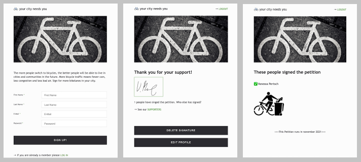

# Petition Project

A personal project developed with handlebars.js and express. One learning objective was to write own middleware to simplify status dependent routing. The App is deployed on heroku via automated deployment from github.

The features include:

- visitors can register
- they can add profile informations
- they can sign the petition
- signatures can be deleted and changed
- signers can see other people who signed the petition and filter by cities.

## Stack

 
 

## Demo

This project was deployed on heroku: [bikelanes-petition.herokuapp.com](https://more-bikelanes-petition.herokuapp.com/).

## Development

To fork and work with this project follow these steps:

1. Clone the repository

   -  `git clone git@github.com:vanpertsch/petition.git`

2. Go inside the directory

   -   `cd petition`

3. Install dependencies

   -   `npm install`

4. Start development server

   -   `node index.js`

## Preview

